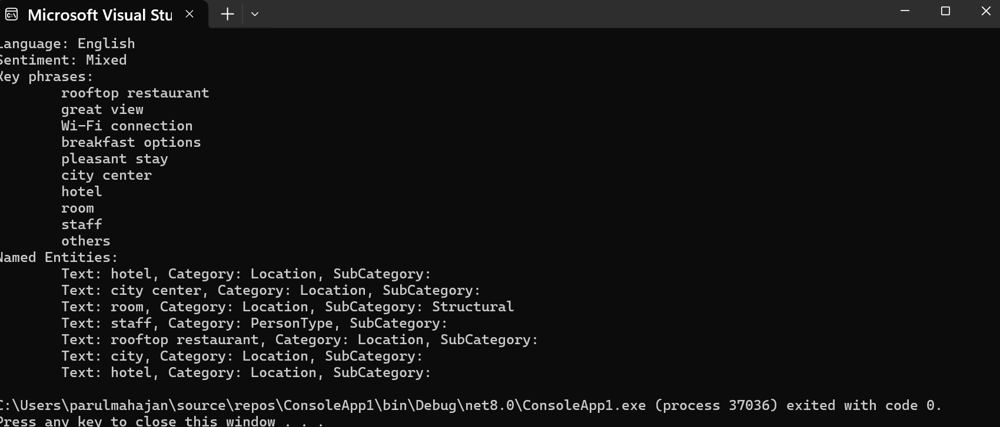

# GitHub Copilot Enabled - Hotel Review Analysis using Azure AI Language Services 🏨
## Overview
In the era of digital transformation, online reviews have become a crucial part of the decision-making process for customers. For a travel agency, understanding these reviews can provide valuable insights into customer preferences, satisfaction levels, and areas for improvement.
Your task is to develop a solution that can process and analyze hotel reviews submitted to the travel agency's website. The solution should be able to:
•	Determine the language each review is written in.
•	Identify the sentiment (positive, neutral, or negative) of the reviews.
•	Extract key phrases that might indicate the main topics discussed in the review.
•	Recognize named entities, such as places, landmarks, or people mentioned in the reviews.
You are required to use Azure AI Language Services for text analytics. To assist with your coding, you should leverage GitHub Copilot, an AI-powered code completion tool.
Steps
1.	Create an Azure AI Service Resource: Start by creating a new resource for Text Analytics in the Azure portal. This will provide you with the necessary API key and endpoint to access the Text Analytics API.
2.	Set Up Your Development Environment: Install the necessary SDKs and libraries for your preferred programming language. Azure supports several languages including C#, Python. 
3.	Process Reviews: Write a function to process the reviews. This function should take a review as input and return the language, sentiment, key phrases, and named entities. Use GitHub Copilot to assist you in writing this function. Simply start typing your function and let GitHub Copilot suggest the rest of the code.
4.	Use Azure AI Language Services: Use the Text Analytics API to analyze the reviews. The API provides methods for language detection, sentiment analysis, key phrase extraction, and named entity recognition. Again, leverage GitHub Copilot to help you write the code to call these APIs.
5.	Display the Results: Finally, display the results in any preferred format. This could be a simple console output, a web page, or even a data visualization. Use GitHub Copilot to assist you in writing the code to display the results.
   

## Example Input Output 

**The hotel was conveniently located near the city center. The room was spacious and clean, and the staff was incredibly friendly and helpful. The rooftop restaurant had a great view of the city. However, the Wi-Fi connection was poor, and the breakfast options were limited. Overall, I had a pleasant stay and would recommend this hotel to others.**

Remember, the goal is to provide valuable insights to the travel agency. So think about how you can present the data in a way that is easy to understand and actionable. And don't forget to use GitHub Copilot to assist you in writing your code.
Good luck! 😄🚀

